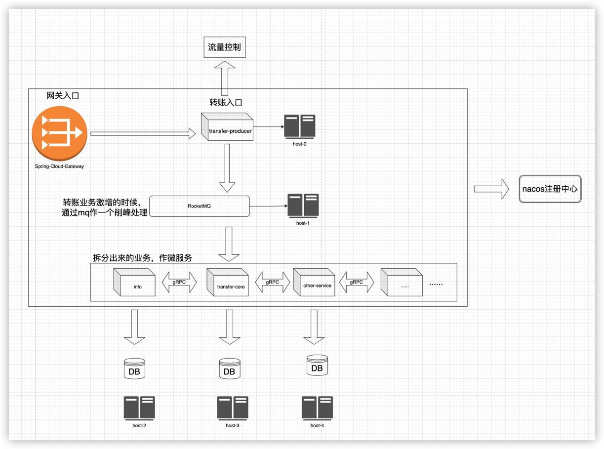
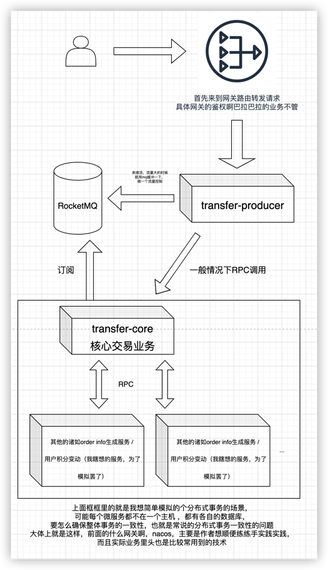

## 粗略的架构图

## 一、阐述
### 1.目的：

    模拟分布式事务
    模拟的是在分布式微服务架构下的转账业务
### 2.会用到哪些开源产品和技术

    Spring Cloud、Spring Cloud Gateway、Spring Security、Spring Boot、
    Nacos、RocketMQ、Seata
    gRPC
    Redis、MySQL
    #后期会增加Sentinel做一个流量控制和熔断降级的实践
    #搭配Jmeter测试QPS

### 3.业务逻辑

    
    
    